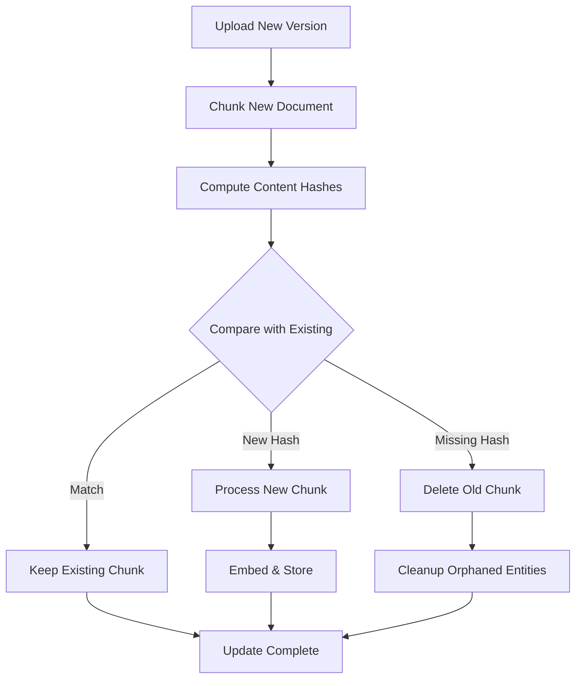

# Incremental Document Updates

Efficiently update documents by only reprocessing changed content using content-hash-based diffing.

## Overview

When large documents need updates, reprocessing the entire document is wasteful. This feature compares content hashes of new chunks against existing chunks to:

- **Preserve unchanged chunks** and their embeddings
- **Only process new/modified content** 
- **Clean up removed chunks** and orphaned entities
- **Maintain graph integrity** after updates

## How It Works



## API Endpoint

### Update Document

```http
PUT /api/documents/{document_id}
Content-Type: multipart/form-data
```

**Request Body:**
- `file`: The new version of the document

**Response:**
```json
{
  "document_id": "abc123",
  "status": "success",
  "changes": {
    "unchanged_chunks": 45,
    "added_chunks": 3,
    "removed_chunks": 2,
    "entities_removed": 5,
    "relationships_cleaned": 12
  },
  "processing_time": 1.24
}
```

### Error Handling

If chunking parameters have changed (different `chunk_size` or `chunk_overlap`):

```json
{
  "status": "error",
  "error": "chunking_params_changed",
  "details": "Document uses chunk_size=1200, overlap=150. Current settings: chunk_size=1000, overlap=100. Full reprocessing required.",
  "current_params": { "chunk_size": 1000, "chunk_overlap": 100 },
  "document_params": { "chunk_size": 1200, "chunk_overlap": 150 }
}
```

To update with different chunking parameters, delete and re-upload the document.

## Frontend Usage

### From Document View
Click the **Update** button in the header to replace content:

1. Click "Update" button (next to Preview)
2. Select the new file
3. Wait for processing
4. Success message shows chunk statistics

### From Upload
When uploading a file, a dialog prompts you to update or upload as new:

1. Click "Upload Files" or drag-drop a file
2. Dialog shows similar existing documents (if any)
3. **New:** Use the **Search bar** to find any document to update
4. Select a document to update, or click "Upload as New"
5. Toast notification confirms the action

## Technical Details

### Schema

The following properties are stored to enable incremental updates:

**Document Node:**
- `chunk_size_used`: Chunk size at initial ingestion
- `chunk_overlap_used`: Chunk overlap at initial ingestion

**Chunk Node:**
- `content_hash`: SHA-1 hash of chunk content (indexed for fast lookup)

### GraphDB Methods

| Method | Description |
|--------|-------------|
| `get_chunk_hashes_for_document(doc_id)` | Returns `{hash: chunk_id}` map |
| `get_document_chunking_params(doc_id)` | Returns stored chunk parameters |
| `delete_chunks_with_entity_cleanup(ids)` | Deletes chunks and cleans up orphaned entities |

### DocumentProcessor

The `update_document()` async method handles the core logic:

1. Validate chunking parameters match
2. Convert and chunk new document
3. Compare content hashes (set operations)
4. Delete removed chunks with entity cleanup
5. Process only added chunks (embed, extract entities)
6. Rebuild chunk similarities if enabled

## Best Practices

- **Keep chunking parameters consistent** - Changing `chunk_size` or `chunk_overlap` requires full reprocessing
- **Use for large documents** - Small documents may not see significant benefits
- **Monitor entity cleanup** - Check `entities_removed` to ensure graph consistency

## Related Features

- [Document Upload](./document-upload.md) - Initial document ingestion
- [Entity Reasoning](./entity-reasoning.md) - Entity extraction from chunks
- [Community Detection](./community-detection.md) - Graph clustering after updates
